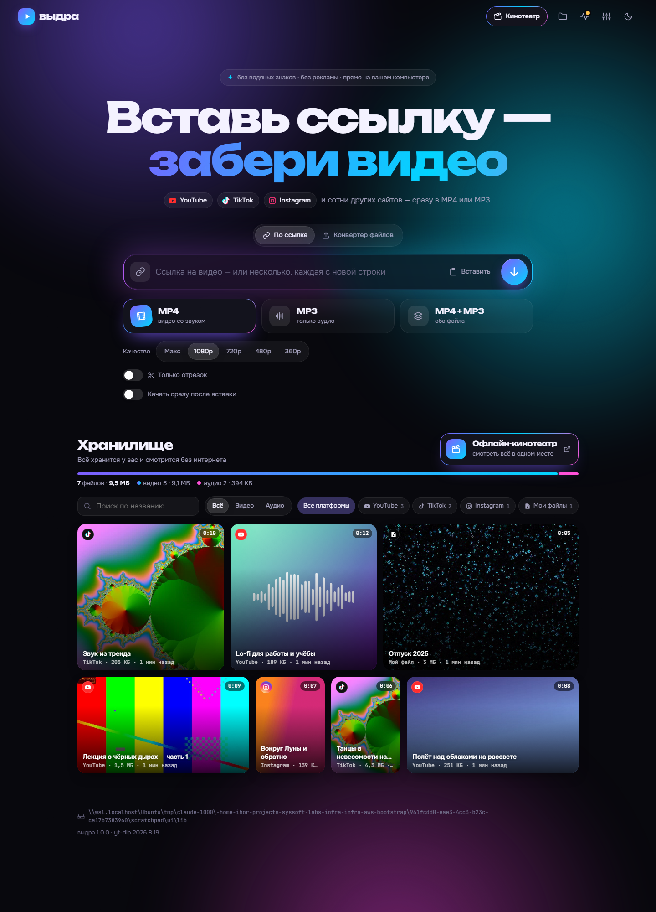
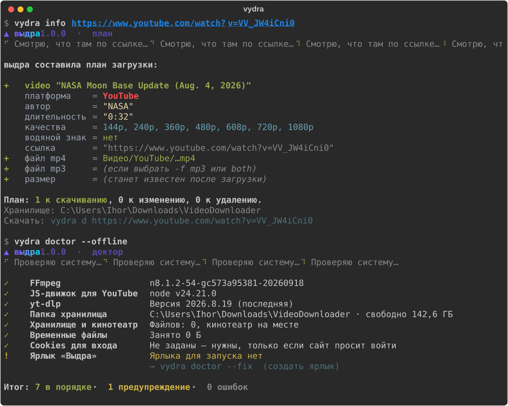
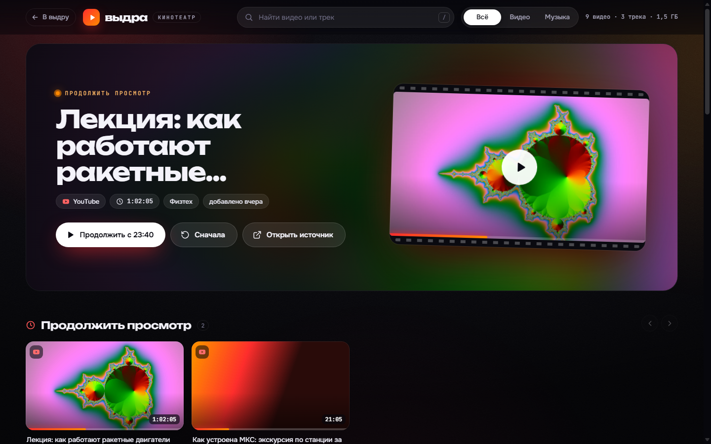

# ▲ выдра

**Скачивает видео с YouTube, TikTok, Instagram и ещё сотен сайтов — без водяных знаков, сразу в MP4 или MP3.**
Веб-интерфейс, консольная программа и офлайн-кинотеатр. Работает на вашем компьютере: без рекламы, без регистрации, без облаков.
Windows, macOS, Linux (и WSL).

<p align="center">
  
</p>

- **Без водяных знаков.** У TikTok берётся чистая версия ролика, а не та, что с логотипом и ником.
- **MP4, MP3 или оба сразу.** Видео приводится к H.264 + AAC и откроется где угодно — в плеере Windows, на телефоне, в Telegram. В MP3 вшиваются обложка и теги.
- **Отрезок.** Можно скачать кусок, например с 1:00 по 5:00: вставили ссылку, передвинули ползунок. Режется точно по кадру.
- **Превью.** Сразу после вставки ссылки видно название, автора, длительность и доступные качества.
- **Хранилище и офлайн-кинотеатр.** Всё раскладывается по папкам `Видео/<платформа>` и `Аудио/<платформа>`. Рядом лежит `Кинотеатр.html`: его можно открыть двойным кликом без интернета и без запущенной выдры. Кинотеатр помнит, где вы остановились.
- **Конвертер своих файлов.** Перетащите любое видео или аудио — получите MP4 или MP3, при желании только отрезок.
- **Консольная версия** с планом загрузки, живыми прогресс-барами, русскими командами и подсказками по Tab.
- **Самодиагностика.** Кнопка «Починить» (или `vydra doctor --fix`) сама скачает FFmpeg, обновит yt-dlp, пересоберёт хранилище и создаст ярлык.

---

## Установка

Нужен только интернет: Python, FFmpeg и остальное установщик поставит сам в папку пользователя, права администратора не нужны.

### Windows

Откройте **PowerShell** (Пуск → «PowerShell») и вставьте:

```powershell
irm https://raw.githubusercontent.com/Ihor-Zakharov/vydra/main/install.ps1 | iex
```

Через минуту-две на рабочем столе появится ярлык **«Выдра»**.

### macOS и Linux

Откройте терминал и вставьте:

```sh
curl -LsSf https://raw.githubusercontent.com/Ihor-Zakharov/vydra/main/install.sh | sh
```

Это же работает в WSL. Там выдра сама найдёт папку «Загрузки» Windows и создаст ярлык на рабочем столе Windows.

<details>
<summary><b>Вручную, если <code>uv</code> уже стоит (две команды)</b></summary>

```sh
uv tool install git+https://github.com/Ihor-Zakharov/vydra
vydra doctor --fix     # FFmpeg, JS-движок для YouTube, ярлык
```

Попробовать без установки:

```sh
uvx --from git+https://github.com/Ihor-Zakharov/vydra vydra ui
```

Поставить `uv`: Windows — `irm https://astral.sh/uv/install.ps1 | iex`, macOS/Linux — `curl -LsSf https://astral.sh/uv/install.sh | sh`.
</details>

<details>
<summary><b>Что именно ставится и куда</b></summary>

| Что | Куда |
|---|---|
| `uv` (менеджер Python) | `~/.local/bin` (Windows: `%USERPROFILE%\.local\bin`) |
| Python 3.13 и выдра | каталог инструментов uv, изолированно от системного Python |
| FFmpeg и Deno, если их нет в системе | папка данных выдры: `%LOCALAPPDATA%\vydra\bin`, `~/Library/Application Support/vydra/bin`, `~/.local/share/vydra/bin` |
| Скачанные видео | `Загрузки/VideoDownloader` (меняется в настройках) |
| Ярлык «Выдра» | рабочий стол (Linux — меню приложений) |

</details>

## Запуск

| Как | Что будет |
|---|---|
| Ярлык **«Выдра»** | откроется веб-интерфейс в браузере |
| `vydra ui` | то же из терминала (адрес — http://localhost:8765) |
| `vydra stop` | остановить веб-интерфейс из любого терминала |
| `vydra` | консольная версия в интерактивном режиме |

Веб-интерфейс работает, пока открыто окно выдры. Он доступен только с этого компьютера: снаружи к нему не подключиться.
Повторный `vydra ui` не запускает второй сервер, а открывает уже работающий; занятый чужой программой порт выдра
обходит сама (8766, 8767…).
Интерфейс можно установить как приложение: в Edge или Chrome есть кнопка «Установить» в адресной строке.

## Как пользоваться

1. Скопируйте ссылку на видео (YouTube, TikTok, Instagram, VK, Vimeo, X, Twitch и ещё [около 1800 сайтов](https://github.com/yt-dlp/yt-dlp/blob/master/supportedsites.md)).
2. Вставьте её в выдру — сразу появится превью.
3. Выберите **MP4**, **MP3** или **оба**, при желании качество и отрезок, и нажмите «Скачать».

Файл появится в хранилище. Горячие клавиши: `Ctrl+V` в любом месте страницы вставляет ссылку, `Enter` запускает загрузку.

## Консольная версия

<p align="center"></p>

```sh
vydra                                   # интерактивный режим: вставил ссылку — выбрал формат
vydra d -f mp3                          # ссылка из буфера обмена: скопировал в браузере — и всё
vydra d '<ссылка>'                      # скачать видео (MP4, до 1080p)
vydra d '<ссылка>' -f mp3 -b 320        # только звук, 320 кбит/с
vydra d '<ссылка>' -f both -q 720       # MP4 720p + MP3
vydra d '<ссылка>' --clip 1:00-5:00     # отрезок с 1-й по 5-ю минуту
vydra d '<ссылка1>' '<ссылка2>'         # несколько сразу
vydra d '<ссылка>' -o "D:\Музыка"       # в другую папку (нет — создастся; в WSL можно путь Windows)
vydra d '<ссылка>' --folder "TikTok/Танцы" --show    # своя папка в хранилище; готово — показать в Проводнике
vydra info '<ссылка>'                   # план: что будет скачано, как terraform plan
vydra convert клип.mov -f mp4           # сконвертировать свой файл
vydra list                              # что в хранилище
vydra open [часть названия]             # показать файл выделенным в Проводнике / Finder (--play — открыть)
vydra folder "D:\Кино" --move           # сменить папку-хранилище и перенести в неё скачанное
vydra ui / vydra stop                   # веб-интерфейс: запустить / остановить
vydra cookies ~/Downloads/cookies.txt   # подключить cookies, если сайт просит войти
vydra settings --art off                # без заставки при входе в `vydra` (или VYDRA_NO_ART=1)
vydra doctor --fix                      # проверить и починить всё
vydra update                            # обновить выдру и yt-dlp до последней версии
```

Ссылку берите в **одинарные кавычки**: символ `&` из адреса YouTube bash и zsh уводят в фон, а ссылка обрезается
(выдра это заметит и подскажет). Проще — скопировать ссылку и не указывать её вовсе. После `vydra completion`
кавычки ставятся сами, а Tab подсказывает команды и ключи.

У каждой команды есть русский синоним: `выдра скачать`, `выдра инфо`, `выдра показать`, `выдра папка`, `выдра стоп`,
`выдра доктор`… Подробная справка — `vydra --help` и `vydra <команда> --help`.
Время можно писать как угодно: `1:30`, `01:02:03`, `90`, `1м30с`; отрезок до конца видео — `--clip 1:00-`.

Если сайт даёт не то, что просили (нет нужного качества, нет звука, только версия с водяным знаком), выдра спросит,
что делать; `-y` соглашается с вариантом по умолчанию сам, а без терминала (скрипт, пайп) это включено всегда.
Ctrl+C останавливает загрузки и убирает временные файлы; второй Ctrl+C — выйти не дожидаясь.

**Для скриптов.** `--json` у `d`, `convert`, `info` и `list` печатает итог одной строкой JSON (настоящие пути файлов),
без прогресса и вопросов. Без терминала обычный вывод не переносит строки, а этапы загрузки пишет по строке.
Коды выхода: `0` — готово, `1` — ничего не скачалось, `2` — неверная команда, `3` — скачано не всё,
`130` — прервано Ctrl+C.

**Подсказки по Tab:** `vydra completion` (bash, zsh, fish, PowerShell). Установщик включает их сам.

## Хранилище и офлайн-кинотеатр

```
VideoDownloader/
├── Видео/
│   ├── YouTube/
│   ├── TikTok/
│   ├── Instagram/
│   ├── Другие сайты/
│   └── Мои файлы/          ← результаты конвертера
├── Аудио/
│   └── …                   ← те же подпапки
├── Кинотеатр.html          ← открывается двойным кликом, работает без интернета
└── .vydra/                 ← служебное: индекс, постеры (скрытая папка)
```

- Папку можно сменить в настройках (шестерёнка → «Хранилище») или командой `vydra folder`. Если указать папку, где уже лежат видео, выдра подхватит их, сделает постеры и добавит в кинотеатр.
- Хранилище переносимо: скопируйте папку на флешку или внешний диск — кинотеатр там тоже откроется.
- Файлы можно добавлять и удалять прямо в Проводнике или Finder, выдра это заметит. Удаление из интерфейса отправляет файл в Корзину.

<p align="center"></p>

## Если что-то сломалось

Откройте **«Состояние системы»** (значок пульса в интерфейсе) или выполните:

```sh
vydra doctor          # проверить
vydra doctor --fix    # починить всё, что можно
```

Доктор проверяет FFmpeg, JS-движок для YouTube, свежесть yt-dlp, доступ к сайтам, папку хранилища и место на диске, индекс и кинотеатр, временные файлы, cookies и ярлык.

| Проблема | Что делать |
|---|---|
| Сайт перестал качаться | `vydra update`: сайты часто меняются, yt-dlp обновляется почти каждую неделю |
| «Сайт просит войти» (закрытый Instagram, возрастные ролики YouTube) | добавьте cookies (см. ниже) |
| «Не показывает с вашего IP-адреса» (TikTok, региональные ограничения) | VPN или cookies |
| «Это прямой эфир» | эфир можно скачать, когда он закончится и появится запись |
| Нет MP4/MP3, ошибка FFmpeg | `vydra doctor --fix` скачает FFmpeg |
| Порт 8765 занят | выдра сама возьмёт свободный; свой — `vydra ui --port 9000` |
| Интерфейс «завис» или после обновления старый | `vydra stop`, затем `vydra ui` |
| Кинотеатр не видит новые файлы | `vydra doctor --fix` пересоберёт хранилище |

### Cookies — только если сайт просит войти

1. Поставьте в браузер расширение **«Get cookies.txt LOCALLY»**.
2. Откройте нужный сайт, войдите в аккаунт и экспортируйте `cookies.txt`.
3. Загрузите файл в выдру: шестерёнка → «Cookies» — или в терминале `vydra cookies путь/к/cookies.txt`
   (`vydra cookies` — что подключено, `vydra cookies --remove` — отключить).

Файл хранится только у вас в папке настроек и используется лишь для загрузок.

## Обновление и удаление

```sh
vydra update                          # выдра и yt-dlp — до последней версии
vydra update --check                  # только посмотреть, есть ли что обновлять
vydra update --only-ytdlp             # только yt-dlp (если сайт перестал качаться)
vydra update --repo ~/src/vydra       # из своей копии репозитория (или --repo <адрес архива>)
uv tool uninstall vydra               # удалить (скачанные видео останутся на месте)
```

`vydra update` (`выдра обновить`) берёт выдру оттуда же, откуда её поставил установщик (по умолчанию — ветка `main`
на GitHub), и показывает «было → стало»: версию, коммит и дату. Установщик запоминает, из какого коммита стоит выдра,
поэтому, если нового нет, обновление ничего не переустанавливает. Работающий веб-интерфейс перезапускается новой
версией сам (в том же окне терминала), Tab-подсказки обновляются. Если новая версия не скачалась или не запускается,
остаётся прежняя — обновление её не ломает. Повторный запуск установщика делает то же самое.

## Для разработчиков

```sh
git clone https://github.com/Ihor-Zakharov/vydra && cd vydra
uv run vydra ui            # запуск из исходников
uv run pytest              # тесты (быстрые, без сети)
uv run pytest -m live      # настоящие загрузки с YouTube, TikTok, Instagram
```

```
vydra/
  cli.py          консольная программа (Typer + Rich)
  main.py         HTTP API (FastAPI) и раздача интерфейса
  jobs.py         очередь задач: скачать → конвертировать → положить в хранилище
  downloader.py   yt-dlp в отдельном процессе: выбор форматов без водяных знаков
  media.py        ffmpeg: MP4 (H.264/AAC), MP3 с обложкой, точная вырезка отрезков
  library.py      хранилище: раскладка по папкам, индекс, постеры, кинотеатр
  health.py       доктор: проверки и починка
  tools.py        доустановка FFmpeg/Deno, обновление yt-dlp, ярлык
  system.py       всё, что зависит от ОС: Windows, WSL, macOS, Linux
  static/         веб-интерфейс, кинотеатр, шрифты (всё локально, без CDN)
```

Переменные окружения для отладки: `VD_LIBRARY_DIR` (зафиксировать папку-хранилище), `VD_PORT`, `VD_WORK_DIR`, `VD_CONFIG_DIR`, `VD_TOOLS_DIR`, `VD_PARALLEL` (сколько загрузок параллельно, по умолчанию 2).

## Важно

Скачивайте только то, на что у вас есть права: свои ролики, контент со свободной лицензией или для личного просмотра там, где это разрешено. Соблюдайте правила сайтов и авторские права.

Под капотом — [yt-dlp](https://github.com/yt-dlp/yt-dlp), [FFmpeg](https://ffmpeg.org), [FastAPI](https://fastapi.tiangolo.com), [Typer](https://typer.tiangolo.com) и [Rich](https://github.com/Textualize/rich). Шрифты Unbounded, Onest и JetBrains Mono распространяются по лицензии SIL Open Font License.
